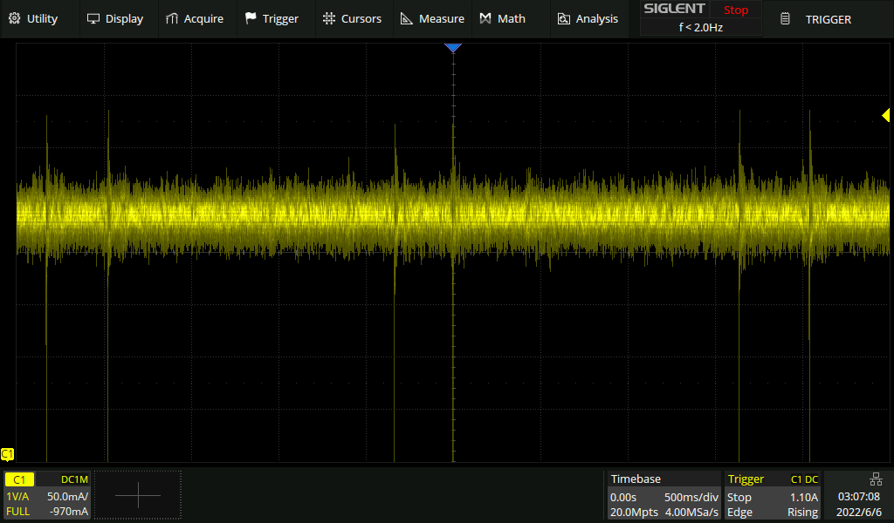
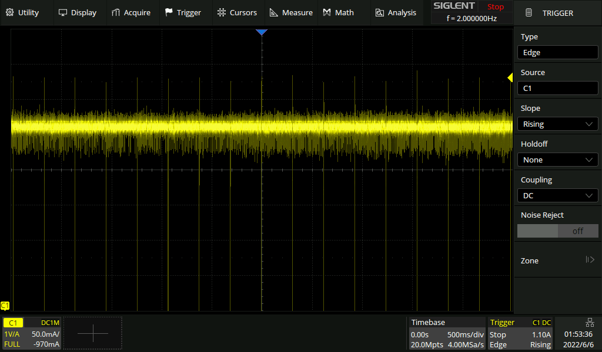
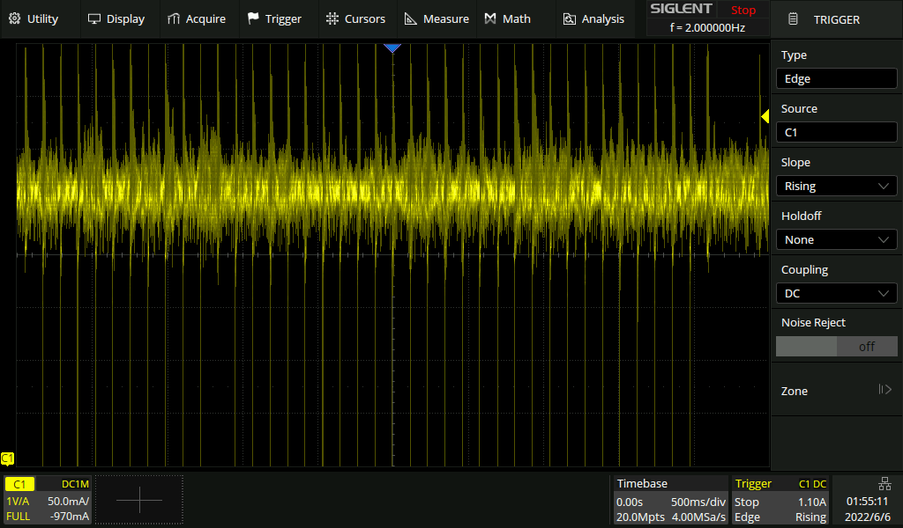
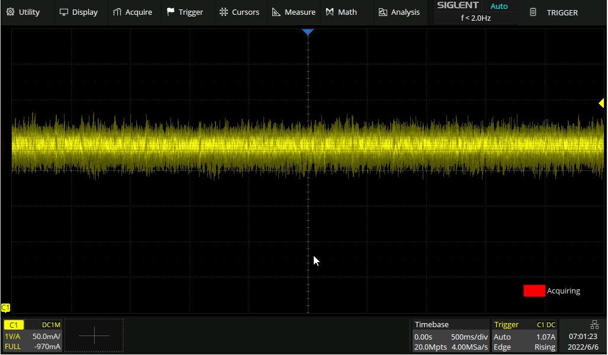

# TeamRedMiner Ethash Smooth Power

## Overview

In TRM, "smooth power" means carefully managing gpu activity to
produce the smoothest possible power draw over time on a fine-grained
level. The technique is used for all gpu types and on all algos in the
ethash family (ethash, etchash, kawpow, firopow). The objective is to
be as nice as possible to the whole power delivery system, from PSU to
risers to GPU VRMs. The assumption is that if we make life easy for
the voltage regulators we should be able to survive on a lower voltage
than in previous TRM versions and other miners. The way we address the
problem in TRM also has the nice side effect of slightly increasing
hashrate on most gpus, normally in the 0.1-0.2% range.

To illustrate what the above means in practice, please see the
following scope captures of 5 secs of uninterrupted ethash mining with
TRM 0.9.4.2, Phoenix 6.2c, lolminer 1.51a, and TRM 0.10.2, all on a
Sapphire Pulse 580 at a ~31 MH/s tuning. All captures were performed
using a Siglent SDS2104X Plus and a 300kHz CP6220 current probe.

| TRM 0.9.4.2 |
|:--:|
|  |

| Phoenix 6.2c |
|:--:|
|  |

| lolminer 1.51a |
|:--:|
|  |

| TRM 0.10.2 |
|:--:|
|  |

Clearly visible, all miners except TRM 0.10.2 suffer from repeated
up/down swings, i.e. deviations from the average power draw. Lolminer
is exhibiting the worst behavior. Phoenix and TRM 0.9.4.2 behave
similarly with Phoenix having slightly less pronounced swings but
occuring more frequently. The outlier is TRM 0.10.2 that has a smooth
continuous draw without any swings at all deviating from the average
level.

To verify that the new behavior in TRM 0.10.2 does indeed translate
into more robust mining at lower voltages we tested running the same
Sapphire Pulse 580 at 1138 MHz core, 2080 MHz mem, ref 30 for 30.9
MH/s at a low core voltage of 793mV.

| Miner          | Result                               |
| -------------- | ------------------------------------ |
| TRM 0.9.4.2    | Crashed immediately after dag build. |
| Phoenix 6.2c   | Crashed after 10 secs of tuning.     |
| lolminer 1.51a | Crashed immediately after dag build. |
| TRM 0.10.2     | Ran for 2h without crashing.         |

NOTE: the smooth power feature was released in v0.10.0, but in
hindsight it needed additional polishing and fine-tuning, especially
for Polaris and Vega gpus. We hope that the version released in
v0.10.2 will address earlier issues.

## GPU tuning and results

This feature normally doesn't need tuning, but a few pointers are
still interesting:

- As you try to minimize voltages, **switch to a static --eth_config
  for all gpus**. This will skip the tuning part and enter the best
  continuous smooth power setup we can produce immediately after the
  dag build.

- Our Polaris tuning had a preference to increase intensity on certain
  mem straps in 0.10.0 and 0.10.1. This could trip some rigs, and was
  not intended. This is fixed in v0.10.2, but we still recommend using
  a static --eth_config when trying to tune for a low voltage.

- As always with advanced features, some gpus simply aren't reacting
  the way theory dictates they should. If you can't seem to get a gpu
  stable regardless of what you try, you can always test turning off
  the smooth power feature. Using e.g. `--eth_smooth_power=1,1,0,0,1`
  would turn it off for gpus 2 and 3 in the rig but keep it enabled
  for gpus 0, 1, and 4. Passing `--eth_smooth_power=0` will turn off
  the feature for all gpus in the rig.

GPU-specific pointers:

- Polaris: we've found that most Polaris gpus can be lowered 10-15mV,
  all else being equal, in some cases more as well. Unfortunately,
  there are always some bad silicon samples that will need a certain
  amount of voltage for stability.

- RX Vegas: same as for Polaris, many gpus can shave off additional
  core voltage but still remain stable. If you've had issues remaining
  stable on RX Vegas in general on later TRM versions, you should try
  switching to v0.10.2 but keep the old tuning. If you still have
  issues, try turning off smooth power.

- VIIs: no expected change in voltage required, no need to retune.

- Navi: our testing indicates that smooth power results in increased
  stability on the vast majority of Navi gpus. For the remaining ones
  that rather seems to be crashing more often, turning off smooth
  power is a good test.
